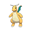
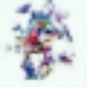

# diffusion model from scratch

This repository contains a diffusion model from scratch, trained on images of Pokemon. The image size (32x32) is relatively small, so the model can be trained on a laptop.

| Training data            |  Model output |
:-------------------------:|:-------------------------:
  |  

## overview

- training time on M1 Pro MacBook with MPS enabled ≈ 4h
- training data: images of all Pokemon
- output image size 32x32

## dependecies

```
pip install torch torchvision numpy tqdm matplotlib
```

## quick start

**Dataset**: Run the notebook `dataset.ipynb`. This creates a `images.npy` and `labels.npy` in the data directory.

**Training**: In order to train the model you have to run:

```
python train.py
```

The training time depends on whether you are using a GPU, MPS on MAC or a CPU. On a MacBook with a M1 Pro chip it takes about 4 hours. The trained model is saved in `weights`.

**Sampling**: Running the notebook `sample.ipynb` creates outputs like this:

 

Additionally, you can specify the type of Pokemon you want to sample by including a type embedding in the notebook `sample_with_type.ipynb`. For example, the output for a Pokemon of type Dragon and Flying looks like this:

 

## acknowledgments

This code is modified from [minDiffusion](https://github.com/cloneofsimo/minDiffusion) and [DeepLearning.AI](https://www.deeplearning.ai/short-courses/how-diffusion-models-work/).

Diffusion model is based on [Denoising Diffusion Probabilistic Models](https://arxiv.org/abs/2006.11239) and [Denoising Diffusion Implicit Models](https://arxiv.org/abs/2010.02502).

Training data is taken from [this](https://www.kaggle.com/datasets/vishalsubbiah/pokemon-images-and-types?resource=download) Pokemon image dataset.